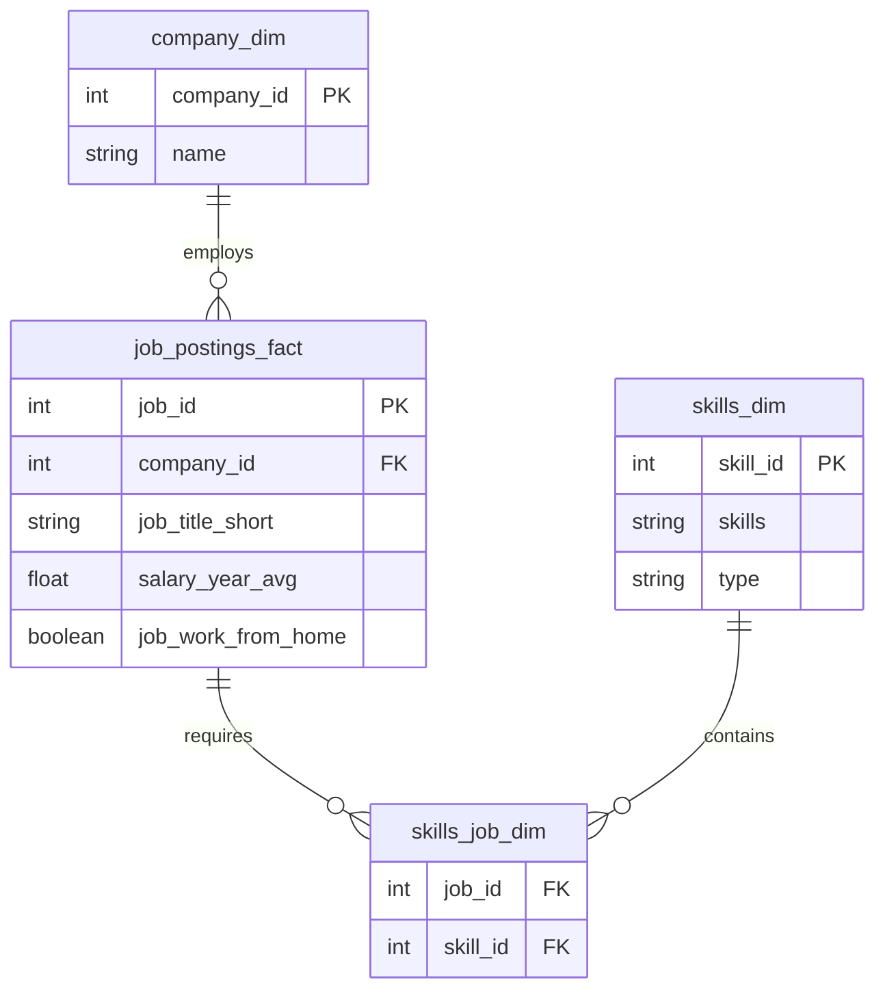

# 📊 SQL Data Job Analysis Project

## Introduction

This project explores the 2023 Data Analyst job market using SQL to uncover valuable insights about salaries, skill demand, and career opportunities.

Using a real-world dataset containing job postings, company information, salary data, and required skills, I analyzed the market to answer five key business questions:

1. What are the highest-paying Data Analyst jobs?
2. What skills are required for those jobs?
3. Which skills are most in demand?
4. Which skills command the highest salaries?
5. Which skills offer the best combination of salary and demand?

---

## Background

The demand for Data Analysts continues to grow as organizations increasingly rely on data-driven decision-making. This project analyzes job posting data from 2023 to identify high-paying opportunities, valuable technical skills, and optimal learning paths — focusing specifically on **remote Data Analyst positions**.

---

## Tools I Used

| Tool | Purpose |
|------|---------|
| SQL | Data querying and analysis |
| PostgreSQL | Database management |
| Visual Studio Code | Query development |
| Git | Version control |
| GitHub | Project documentation and portfolio hosting |

---

## Database Structure



---

## The Analysis

### 1. Top Paying Data Analyst Jobs

**Objective:** Identify the highest-paying remote Data Analyst positions.

**SQL Concepts Used:** `WHERE`, `ORDER BY`, `LIMIT`, `LEFT JOIN`

```sql
SELECT
    job_id,
    job_title,
    name AS company_name,
    salary_year_avg
FROM job_postings_fact
LEFT JOIN company_dim
    ON job_postings_fact.company_id = company_dim.company_id
WHERE
    job_title_short = 'Data Analyst'
    AND salary_year_avg IS NOT NULL
    AND job_work_from_home = TRUE
ORDER BY salary_year_avg DESC
LIMIT 10;
```

**Insights:**
- The highest-paying remote Data Analyst positions exceed six-figure salaries.
- Many of these positions require advanced analytical skills and experience with large datasets.

---

### 2. Skills Required for Top Paying Jobs

**Objective:** Determine which skills employers seek for the highest-paying Data Analyst positions.

**SQL Concepts Used:** CTEs, `INNER JOIN`, Filtering

```sql
WITH top_paying_jobs AS (
    SELECT
        job_id,
        job_title,
        salary_year_avg
    FROM job_postings_fact
    WHERE
        job_title_short = 'Data Analyst'
        AND salary_year_avg IS NOT NULL
        AND job_work_from_home = TRUE
    ORDER BY salary_year_avg DESC
    LIMIT 10
)
SELECT
    top_paying_jobs.*,
    skills
FROM top_paying_jobs
INNER JOIN skills_job_dim
    ON top_paying_jobs.job_id = skills_job_dim.job_id
INNER JOIN skills_dim
    ON skills_job_dim.skill_id = skills_dim.skill_id
ORDER BY salary_year_avg DESC;
```

**Insights:**
- SQL and Python appeared frequently among top-paying positions.
- Tableau and Power BI also appeared regularly, highlighting the value of data visualization skills.

---

### 3. Most In-Demand Skills

**Objective:** Identify the skills most frequently requested in remote Data Analyst job postings.

**SQL Concepts Used:** `COUNT()`, `GROUP BY`, `ORDER BY`

```sql
SELECT
    skills,
    COUNT(skills_job_dim.job_id) AS demand_count
FROM job_postings_fact
INNER JOIN skills_job_dim
    ON job_postings_fact.job_id = skills_job_dim.job_id
INNER JOIN skills_dim
    ON skills_job_dim.skill_id = skills_dim.skill_id
WHERE
    job_title_short = 'Data Analyst'
    AND job_work_from_home = TRUE
GROUP BY skills
ORDER BY demand_count DESC
LIMIT 5;
```

**Results:**

| Skill | Demand Count |
|-------|-------------|
| SQL | 7291 |
| Excel | 4611 |
| Python | 4330 |
| Tableau | 3745 |
| Power BI | 2609 |

**Insights:**
- SQL remains the most important skill, appearing in over 7,000 job postings.
- Excel, Tableau, and Power BI remain essential despite the rise of modern analytics platforms.

---

### 4. Highest Paying Skills

**Objective:** Determine which skills are associated with the highest average salaries.

**SQL Concepts Used:** `AVG()`, `ROUND()`, `GROUP BY`

```sql
SELECT
    skills,
    ROUND(AVG(salary_year_avg), 0) AS avg_salary
FROM job_postings_fact
INNER JOIN skills_job_dim
    ON job_postings_fact.job_id = skills_job_dim.job_id
INNER JOIN skills_dim
    ON skills_job_dim.skill_id = skills_dim.skill_id
WHERE
    job_title_short = 'Data Analyst'
    AND salary_year_avg IS NOT NULL
    AND job_work_from_home = TRUE
GROUP BY skills
ORDER BY avg_salary DESC
LIMIT 25;
```

**Results:**

| Skill | Avg Salary |
|-------|-----------|
| PySpark | $208,172 |
| Bitbucket | $189,155 |
| Couchbase | $160,515 |
| DataRobot | $155,486 |
| GitLab | $154,500 |

**Insights:**
- The highest-paying skills are associated with Data Engineering, ML, Cloud Computing, and DevOps.
- Employers pay a premium for these specialized skills even when they appear less frequently in postings.

---

### 5. Optimal Skills to Learn

**Objective:** Identify skills that are both highly demanded and highly paid.

**SQL Concepts Used:** `COUNT()`, `AVG()`, `HAVING`, `GROUP BY`, `ORDER BY`

```sql
SELECT
    skills_dim.skill_id,
    skills_dim.skills,
    COUNT(skills_job_dim.job_id) AS demand_count,
    ROUND(AVG(job_postings_fact.salary_year_avg), 0) AS avg_salary
FROM job_postings_fact
INNER JOIN skills_job_dim
    ON job_postings_fact.job_id = skills_job_dim.job_id
INNER JOIN skills_dim
    ON skills_job_dim.skill_id = skills_dim.skill_id
WHERE
    job_title_short = 'Data Analyst'
    AND salary_year_avg IS NOT NULL
    AND job_work_from_home = TRUE
GROUP BY skills_dim.skill_id
HAVING COUNT(skills_job_dim.job_id) > 10
ORDER BY
    avg_salary DESC,
    demand_count DESC
LIMIT 25;
```

**Insights:**
- Python, SQL, Tableau, and Power BI offer the strongest overall career value.
- This analysis balances salary potential with market demand rather than optimizing for just one metric.

---

## What I Learned

### SQL Skills Developed
- Data filtering using `WHERE`
- Sorting and ranking using `ORDER BY`
- Aggregations with `COUNT` and `AVG`
- Multi-table joins
- Common Table Expressions (CTEs)
- Grouping and summarization
- `HAVING` clauses for aggregated filtering

### Analytical Skills Developed
- Transforming business questions into SQL queries
- Identifying trends in large datasets
- Evaluating trade-offs between salary and demand
- Communicating insights through data storytelling

---

## Conclusions

| # | Finding |
|---|---------|
| 1 | **SQL Is Essential** — Most requested skill across all DA job postings |
| 2 | **Excel Still Matters** — Appears in thousands of job descriptions |
| 3 | **Python Is Growing** — Increasingly a core requirement |
| 4 | **Specialized Skills = Higher Pay** — Data Engineering & Cloud tools pay more |
| 5 | **Balance Demand & Salary** — Best strategy for long-term career growth |

---

## Recommended Learning Path

```
Excel → SQL → Power BI / Tableau → Python → Pandas & NumPy → Advanced Analytics
```

---

## Project Structure

```
project_sql/
│
├── 1_top_paying_jobs.sql
├── 2_top_paying_job_skills.sql
├── 3_top_demanded_skills.sql
├── 4_top_paying_skills.sql
├── 5_optimal_skills.sql
│
└── README.md
```

---

## Author

**Maqdoom Abdul Hannan**

Aspiring Data Analyst passionate about transforming data into actionable insights through SQL, analytics, and business intelligence tools.

[](https://github.com/abduvk)